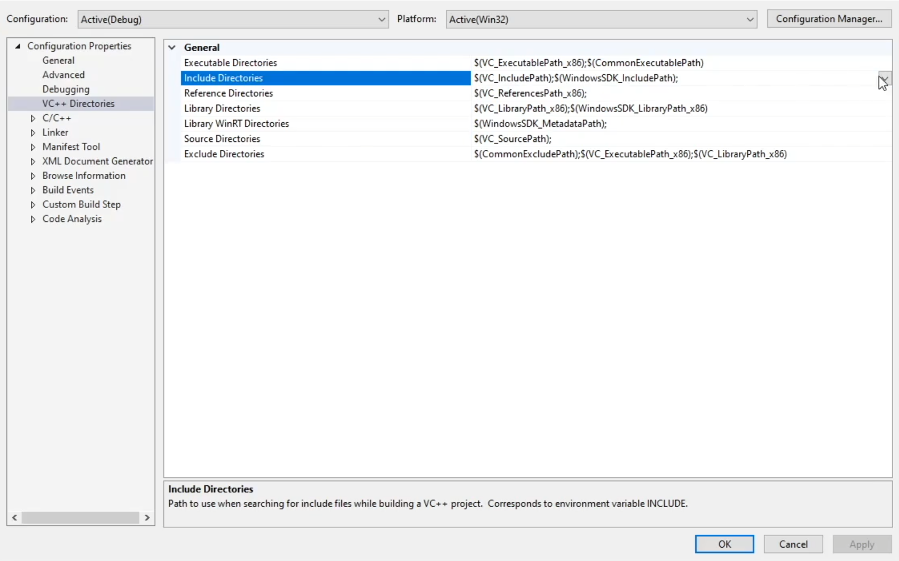
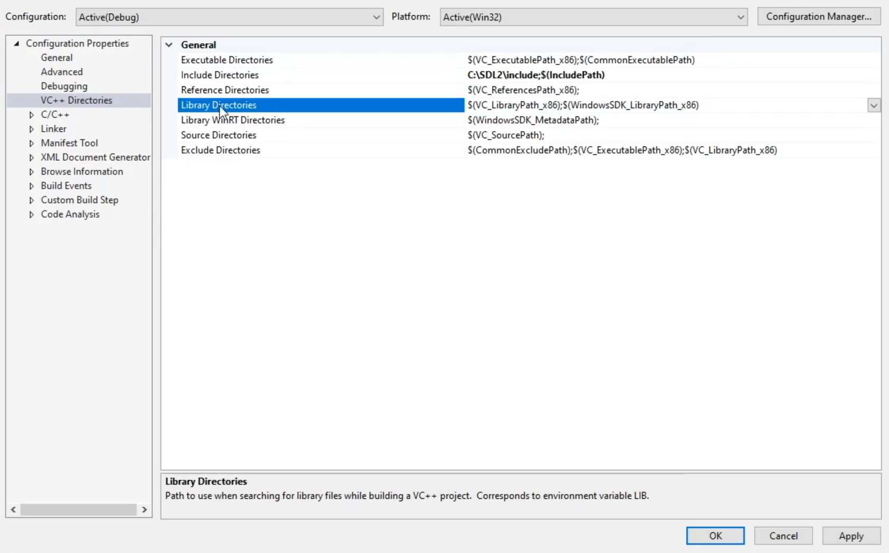
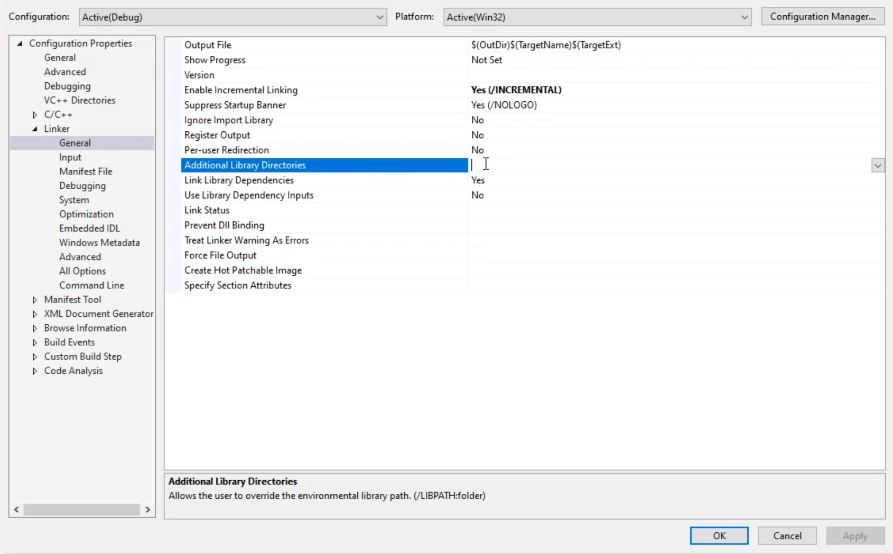
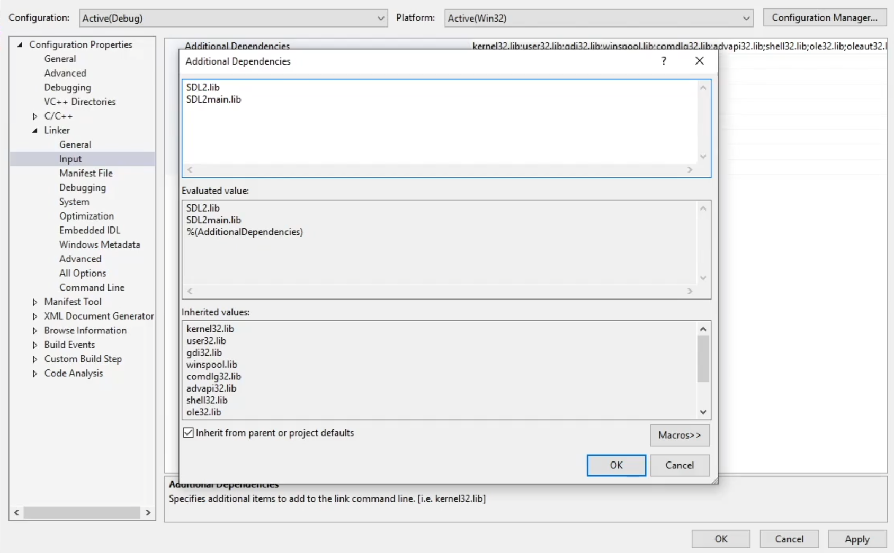

# 3D Renderer - Project Setup

Although this is probably not an interesting topic to start with, I want to write about the setup of the project for our 3D renderer from scratch.

For those of you who missed the series introduction, the renderer will be written in glorious C and use SDL for cross-platform concerns like creating a window and input handling. I don't want to waste time building an OS abstraction for handling these tasks with native APIs since that's not the focus for this project.

## Directory Structure
We're keeping the directory structure as simple as possible to start out. All we need is a root and `src` folder. I don't know what I'll end up naming this project, so for now I'm sticking with `3drenderer`.

This will work well for using Neovim or any other editor on macOS and Linux. However, I also want to include Visual Studio Solution and Project files so I can develop across platforms. I added a new directory called `msvs` for this to keep it isolated. Since SDL2 development libraries need to be downloaded manually for Windows, I added a copy of them to `src/lib/sdl`.

```
3drenderer
├── src
│   ├── main.h
│   ├── main.c
│   ├── ... 
├── msvs
│   ├── lib
│   │   ├── sdl
│   │   │   ├── include
│   │   │   ├── lib
│   │   │   │   ├── x86
│   │   │   │   ├── x64
│   │   └── ...
├── Makefile
├── README.md
└── .gitignore
```

## macOS and Linux
As you'd expect, setting up the project on macOS and Linux is quite simple. I'm using `apt` and `brew` to install SDL2 on Linux and macOS respectively.

### Linux
If you're missing build essentials, go ahead and install those as well.

```bash
sudo apt install build-essential
sudo apt install libsdl2-dev
```

### macOS
```
brew install sdl2
```

Brew will download SDL2 in the `opt/homebrew/Cellar/sdl2` directory which is not in a default gcc search location. You will know this is the case if later when you try to compile `main.c` you see a compiler or linker error related to missing SDL files. There are a few different ways to resolve this issue.

First, the option I went with, examine the search paths gcc uses with the following command. I found that `/usr/local/include` and `/usr/local/lib` are checked by default.
```
echo | gcc -xc -E -v -
```

I created symlinks for the SDL2 include directory from homebrew into the /usr directories so that gcc will be able to find them.

Another approach is to provide the include and libary paths to gcc via `-I` and `-L`. Although this adds quite a bit of noise to call gcc, we'll use a Makefile so we don't need to type this out every time.

```bash
gcc src/main.c -Wall -std=c99 -Ipath/to/includes -L/path/to/lib
```

## Windows
Unfortunately, we have extra steps to get set up on Windows. There are several ways to go about this. You could download Visual Studio Build Tools and use any code edtor along with [cl](https://learn.microsoft.com/en-us/cpp/build/reference/compiler-command-line-syntax?view=msvc-170) to compile. You can find equivalent flags to get a similar behavior to what we use on macOS and Linux with gcc.

However, most people prefer downloading Visual Studio and adding the `Desktop Development with C++` workload to get a full IDE and C/C++ compiler up and running quickly. I'll cover this approach.

You can install Visual Studio Community with nuget.

```bash
winget install -e Microsoft.VisualStudio.2022.Community
```

When that's done, open the Visual Studio Installer, choose `Modify` and check `Desktop Development with C++` and install.

I downloaded the SDL2 development files and added them to the `msvs/lib` directory. We need to modify the project properties to add the SDL include and library files.

Add the SDL include files to `Include Directories` in VC++ Directories.


Add the SDL library directory to `Library Directories` in VC++ Directories.


Add the SDL library directory to `Additional Library Directories` in Linker/General. 


Add the library names `SDL2.lib` and `SDL2main.lib` to `Library Directories` in Linker/General. 


## Compiling and Linking
We need just a few lines of code to test that we can compile and link successfully. This is the content of `main.c`.

```c
#include <stdio.h>
#include <SDL2/SDL.h>

int main(void) {
    SDL_Init(SDL_INIT_EVERYTHING);
    printf("This is where it all begins!\n");
    return 0;
}
```

Now a quick test via gcc should confirm everything is working as expected.

```bash
gcc src/main.c -Wall -std=c99 -o renderer
```

## Makefile
To avoid having to type the entire gcc call every time, we can use a Makefile with a few simple actions; build, run and clean. You don't need to know a lot about GNU Make to follow along use, but you can read more about it [here](https://www.gnu.org/software/make/manual/make.html#Rule-Introduction).

As you've seen in the directory structure, the `Makefile` is created at the root `3drenderer` directory. Here are the only actions we need to start.

```Makefile
build:
	gcc -Wall -std=c99 ./src/*.c -lSDL2 -o renderer

run:
	./renderer

clean:
	rm renderer
```

With that in place, we're able to invoke these actions, for example, `make build`. Even better, the first action is invoked by default so we can just use `make`.

Until next time.  
Take care.  
Stay awesome.
