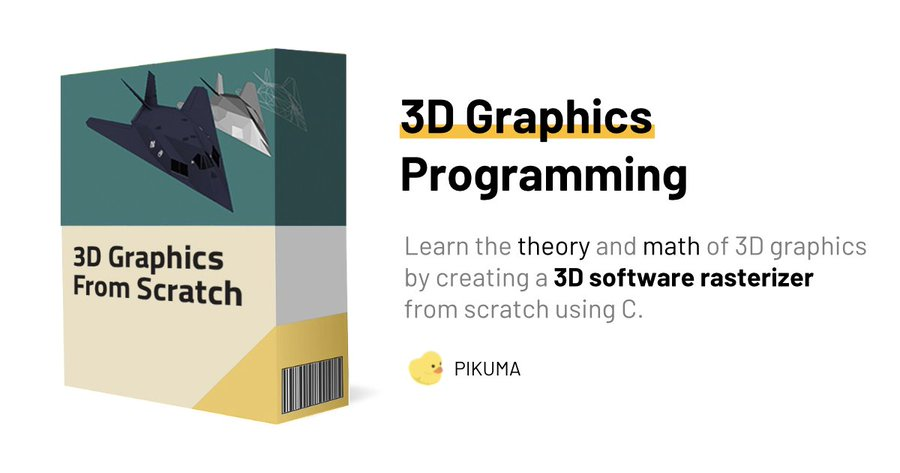

# Learning 3D Graphics From Scratch

I'm starting a new blog series based on my fascination with 3D graphics rendering. 

The very first game I built used DirectX, and throughout my career, I've only used graphics APIs (DirectX and OpenGL).

However, it's time to open the black box and find out what these APIs are doing. I want to have a deep understanding of all the math, data structures, and algorithms involved in creating my own 3D renderer.

The renderer will be written in glorious C and use SDL for cross-platform concerns like creating a window and input handling. I don't want to waste time building an OS abstraction for handling these tasks with native APIs since that's not my focus for this project.

Although there are many books on the topic, I'm going with Pikuma's [3D Graphics Programming from Scratch](https://pikuma.com/courses/learn-3d-computer-graphics-programming) course. If you've never heard of or gone through a Pikuma course before, I highly encourage you to take a look at the [courses](https://pikuma.com/courses). If you're interested in homebrew game development, check out [NES Programming with 6502 Assembly](https://pikuma.com/courses/nes-game-programming-tutorial).

Every week, I'll post at least 1 article talking about what I've learned and the progress I've made.

One final note: because I frequently work across platforms, I plan to include everything needed to develop and test the renderer across platforms (macOS, Linux, and Windows). So, you can expect Visual Studio solution and project files to be available, as well as being able to open the files in any editor on macOS and Linux.

Until next time.

Take care.  
Stay awesome.
